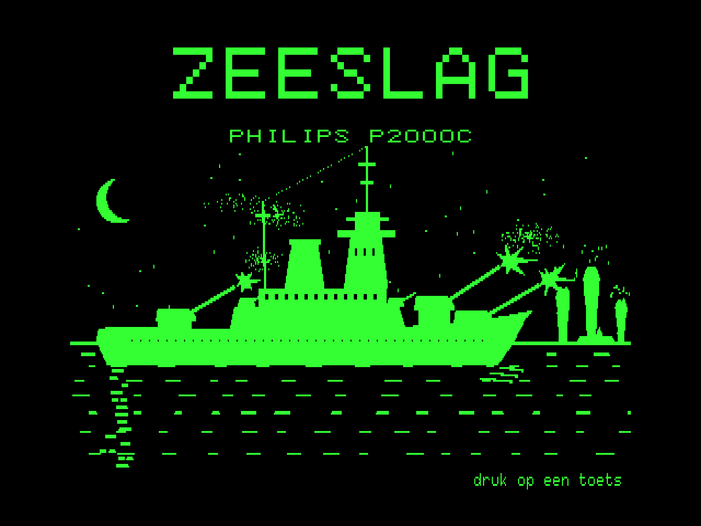
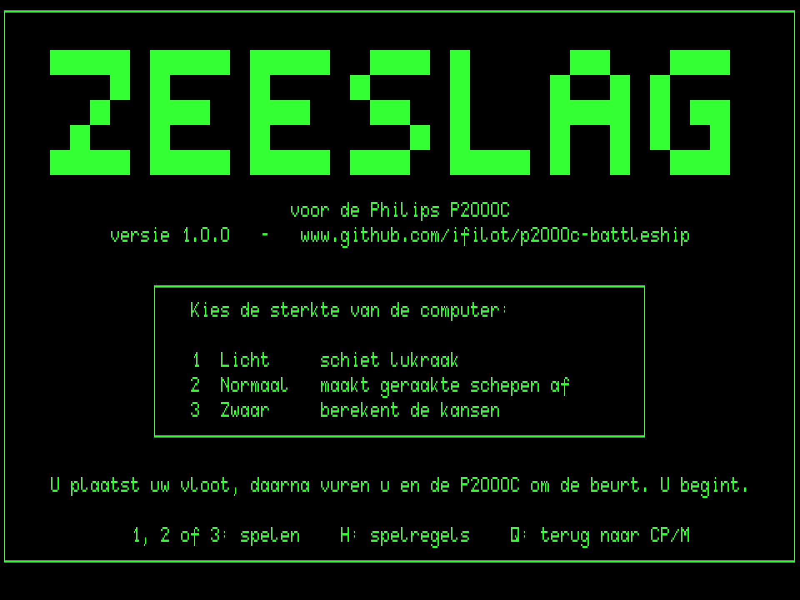
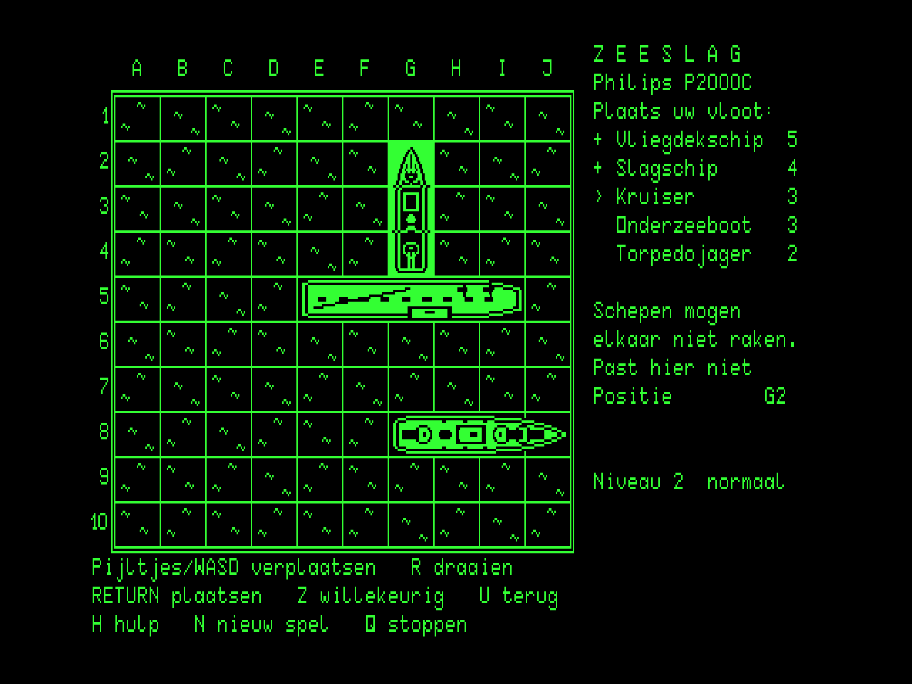
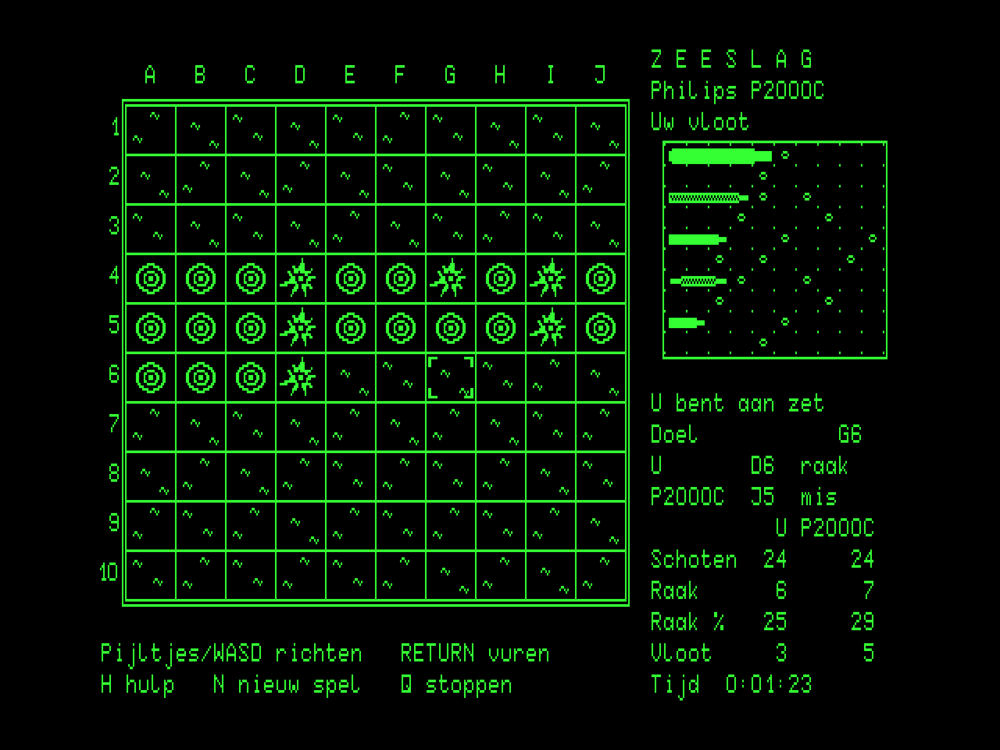
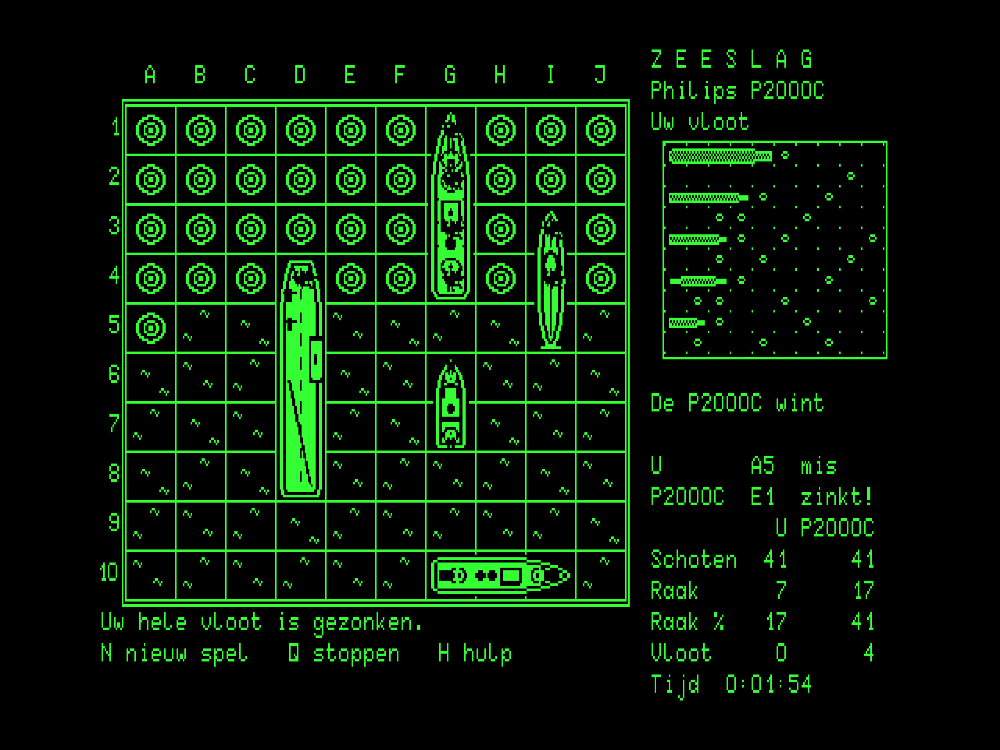

# Zeeslag (Battleship) for the Philips P2000C

[](https://github.com/ifilot/p2000c-battleship/actions/workflows/build.yml)
[](https://github.com/ifilot/p2000c-battleship/releases)
[](LICENSE)

Zeeslag, the classic game of Battleship, against the computer on the Philips
P2000C running CP/M. The battle is drawn in the terminal board's 512x252
high-resolution graphics mode: top-down pictures of the ships, a sea of
waves, splashes, fire and wrecks, and a mini map of your own fleet. The
text plane carries the score panel. The user interface is in Dutch. Three
difficulty levels are offered at the start.

> [!NOTE]
> **More P2000C games:** Check out [Chess](https://github.com/ifilot/p2000c-chess),
> [Minesweeper](https://github.com/ifilot/p2000c-minesweeper),
> [Othello](https://github.com/ifilot/p2000c-othello), and
> [Tetris](https://github.com/ifilot/p2000c-tetris). For an all-in-one setup
> containing all five games, see the [P2000C ZuluBlaster SASI drive distribution](https://github.com/ifilot/p2000c-zulublaster-sasi-drive).

<p align="center">
  
  
</p>
<p align="center">
  
  
</p>
<p align="center">
  
</p>

## Play

Download `ZEESLAG.COM` from the [releases](https://github.com/ifilot/p2000c-battleship/releases)
(or the latest [build artifact](https://github.com/ifilot/p2000c-battleship/actions)),
copy it to a CP/M disk and run `ZEESLAG`. With a ZuluBlaster/SASI setup,
`make deploy` produces `build/HD1_256.hda`, a second-disk image in the
standard split layout with the game on F:. Copy it to the SD card in place
of the distribution's `HD1_256.hda` and run `F:ZEESLAG`. The start screen
is plain text, so it appears instantly, and asks for the difficulty; `1`,
`2` or `3` starts the game.

Both sides have a fleet of five ships on a 10x10 sea: an aircraft carrier
(*vliegdekschip*, 5 cells), a battleship (*slagschip*, 4), a cruiser
(*kruiser*, 3), a submarine (*onderzeeboot*, 3) and a destroyer
(*torpedojager*, 2). Ships lie straight, horizontally or vertically, and
may not touch each other, not even at a corner. You place your fleet first;
a ship that cannot lie where it is shown in inverse video. Then the big grid
turns to the enemy's sea, your fleet moves to the mini map, and you and the
P2000C fire one shot each in turn. You fire first. A shot is *mis*, *raak*
(hit) or *gezonken* (sunk) once every cell of a ship has been hit. Whoever
sinks the other's whole fleet first wins.

| Key | Action |
| --- | --- |
| Cursor keys or `W` `A` `S` `D` | Move the ship being placed, or the gun sight |
| `RETURN` or space | Place the ship; fire |
| `R` | Turn the ship being placed |
| `Z` | Place the whole fleet at random |
| `U`, `BS` or `DEL` | Pick up the ship placed last |
| `H` | Help screen with the rules (plain text mode) |
| `N` | Back to the start screen for a new game |
| `Q` | Quit, after confirmation (immediate on the start screen) |

A shot animates on the big grid: the gun sight closes on the cell, an
explosion or a plume of water follows, and the cell keeps a fire or splash
rings. A ship you sink flashes and is revealed as a wreck. The computer's
shots show as a blinking box on the mini map, where hits are marked on your
ships and sunk ships fade to a dithered ghost. The panel keeps shots, hits,
hit ratio and ships afloat for both sides, plus the game clock. At the end
the computer's surviving ships are revealed. After five minutes without a
keypress a screen saver blanks the picture; any key brings it back.

### Levels

The computer keeps its own chart of your sea. It also notes what the rules
give away: the diagonal neighbours of a hit are water, and so is the ring
around a sunk ship.

| Level | Strategy | Shots to sink a random fleet (mean, simulated) |
| --- | --- | --- |
| 1 *licht* | fires at random | 95 |
| 2 *normaal* | hunts at random; after a hit it tries the neighbours and follows a line of hits | 50 |
| 3 *zwaar* | counts, for every open cell, the ways the ships still afloat could lie across it, and fires at the likeliest cell | 39 |

Level 3 thinks for up to about 0.7 s per shot (4 MHz, emulated).

## Build

The program is C (Z88DK/sdcc) with the display driver in Z80 assembly. It is
compiled with the `z88dk/z88dk` Docker image:

```sh
make build            # -> build/ZEESLAG.COM
```

The other targets use the sibling checkouts
[p2000c-cpm-disk-tool](https://github.com/ifilot/p2000c-cpm-disk-tool)
(headless emulator, CP/M disk images) and
[p2000c-emulator](https://github.com/ifilot/p2000c-emulator) (graphical
emulator, character-ROM font):

```sh
make run              # open the game in the graphical emulator (WSLg/Linux)
make screenshot       # plain raster dumps (green on black) -> build/placing.png, battle.png, end.png
make test             # whole games at every level in the headless emulator
make deploy           # build/HD1_256.hda: second SASI disk with ZEESLAG.COM on F:
make sprites          # regenerate src/sprites.h (preview: build/sprites_preview.png) and src/splash.h
python3 tools/bench.py 20   # emulated seconds per round at every level
```

`make test` places a fleet by hand (including one refused placement),
fires at every cell in reading order at each level, and then reads both
fleets from memory. It checks the placement rules, the shot and hit
counters, that no cell was fired at twice, the panel, and the announced
winner.

## License

GNU General Public License v3.0; see [LICENSE](LICENSE). The character-ROM
font sheet used only by the generators and the screenshot tooling belongs
to the [p2000c-emulator](https://github.com/ifilot/p2000c-emulator)
project.
